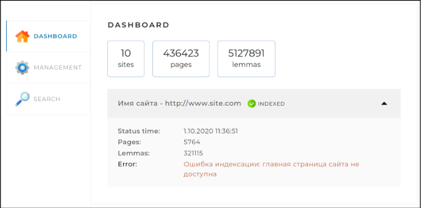
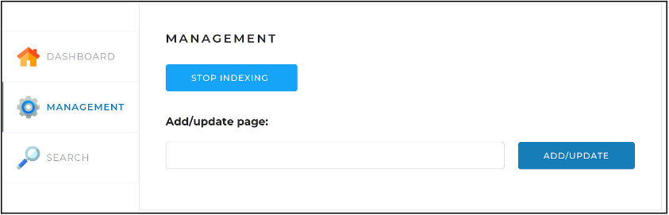
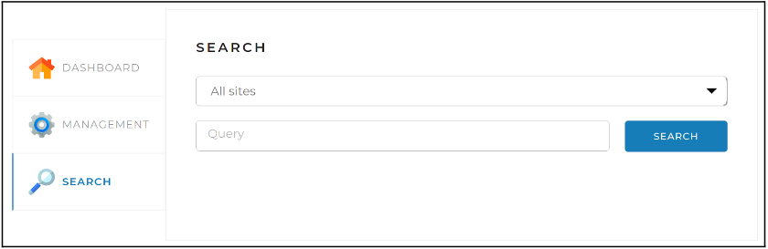

# Проект "Локальный поисковый движок по сайту"

## Описание работы проекта
Поисковый движок обходит сайты, указанные в конфигурационном файле,
а также отдельные страницы, введенные в строке ввода Веб-интерфейса,
и индексирует их, сохраняя данные в базе данных MySQL. После этого
осуществляет поиск проиндексированных страниц, которые содержат
слова или фразу, введенные в строке запроса Веб-интерфейса, и выдает
результат в виде списка ссылок на эти страницы. Проект использует
библиотеки лемматизаторы. Содержит несколько контроллеров, сервисов
и репозиториев с подключением к бд MySQL.

## Описание веб-интерефейса
Веб-интерфейс проекта представляет собой одну веб-страницу с тремя
вкладками:

* ### Dashboard
Эта вкладка открывается по умолчанию. На ней отображается
общая статистика по всем сайтам, а также детальная статистика и
статус по каждому из сайтов
(статистика, получаемая по запросу /api/statistics).



* ### Management.
На этой вкладке находятся инструменты управления поисковым движком 
— запуск и остановка полной индексации (переиндексации) сайтов,
а также возможность добавить (обновить) отдельную страницу по ссылке:



* ### Search.
Эта страница предназначена для тестирования поискового движка.
На ней находится поле поиска, выпадающий список с выбором сайта
для поиска, а при нажатии на кнопку «Найти» выводятся результаты
поиска (по API-запросу /api/search):



## Настройки для запуска

### Зависимости

Для подключения к проекту зависимостей необходимо настроить Maven
конфигурацию в файле `settings.xml`.

В зависимостях, в файле `pom.xml` добавлен репозиторий для получения
jar файлов:

```xml
<repositories>
  <repository>
    <id>skillbox-gitlab</id>
    <url>https://gitlab.skillbox.ru/api/v4/projects/263574/packages/maven</url>
  </repository>
</repositories>
```

Так как для для получения данных из публичного репозитория
требуется авторизации по токену, необходимо указать его в файле
`settings.xml`.

* В Windows он располагается в директории `C:/Users/<Имя вашего пользователя>/.m2`
* В Linux директория `/home/<Имя вашего пользователя>/.m2`
* В macOs по адресу `/Users/<Имя вашего пользователя>/.m2`

Актуальный токен [находится в документе по ссылке](https://docs.google.com/document/d/1rb0ysFBLQltgLTvmh-ebaZfJSI7VwlFlEYT9V5_aPjc/edit?usp=sharing).
Его надо вставить в тег `<value>...</value>` и добавить внутрь тега
`settings` в следующем тексте:

```xml
<servers>
  <server>
    <id>skillbox-gitlab</id>
    <configuration>
      <httpHeaders>
        <property>
          <name>Private-Token</name>
          <value>место для вставки токена</value>
        </property>
      </httpHeaders>
    </configuration>
  </server>
</servers>
```

❗️Если файла `settings.xml` нет, то создайте и вставьте в него:

```xml
<settings xmlns="http://maven.apache.org/SETTINGS/1.0.0"
          xmlns:xsi="http://www.w3.org/2001/XMLSchema-instance"
          xsi:schemaLocation="http://maven.apache.org/SETTINGS/1.0.0
 https://maven.apache.org/xsd/settings-1.0.0.xsd">

  <servers>
    <server>
      <id>skillbox-gitlab</id>
      <configuration>
        <httpHeaders>
          <property>
            <name>Private-Token</name>
            <value>место для вставки токена</value>
          </property>
        </httpHeaders>
      </configuration>
    </server>
  </servers>

</settings>
```

После этого, в проекте обновите зависимости (Ctrl+Shift+O / ⌘⇧I) или
принудительно обновите данные из pom.xml. 

Для этого вызовите контекстное меню у файла `pom.xml` в дереве файла
проектов **Project** и выберите пункт меню **Maven -> Reload Project**.

⁉️ Если после этого у вас остается ошибка:

```text
Could not transfer artifact org.apache.lucene.morphology:morph:pom:1.5
from/to gitlab-skillbox (https://gitlab.skillbox.ru/api/v4/projects/263574/packages/maven):
authentication failed for
https://gitlab.skillbox.ru/api/v4/projects/263574/packages/maven/russianmorphology/org/apache/
    lucene/morphology/morph/1.5/morph-1.5.pom,
status: 401 Unauthorized
```

Почистите кэш Maven. Самый надежный способ, удалить директорию:

- Windows `C:\Users\<user_name>\.m2\repository`
- macOs `/Users/<user_name>/.m2/repository`
- Linux `/home/<user_name>/.m2/repository`

где `<user_name>` - имя пользователя под которым вы работаете.

После этого снова попробуйте обновить данные из `pom.xml`

### Настройки подключения к БД

В проект добавлен драйвер для подключения к БД MySQL. Для запуска проекта,
убедитесь, что у вас запущен сервер MySQL 8.x.
Создайте БД `search_engine` и замените логин и пароль
в файле конфигурации `src/resources/application.yml`:

```yaml
spring:
  datasource:
    username: root # имя пользователя
    password: Kimk7FjT # пароль пользователя
```

### Настройка сайтов для обхода
Задайте необходимые сайты для индексации в файле конфигурации
`src/resources/application.yml` согласно приведённому примеру:
```yaml
indexing-settings:
sites:
- url: https://www.lenta.ru
  name: Лента.ру
- url: https://www.skillbox.ru
  name: Skillbox
- url: https://www.playback.ru
  name: PlayBack.Ru
```

### Запуск
Запустите проект и откройте его через браузер по адресу: 
[http://localhost:8080/](http://localhost:8080/)